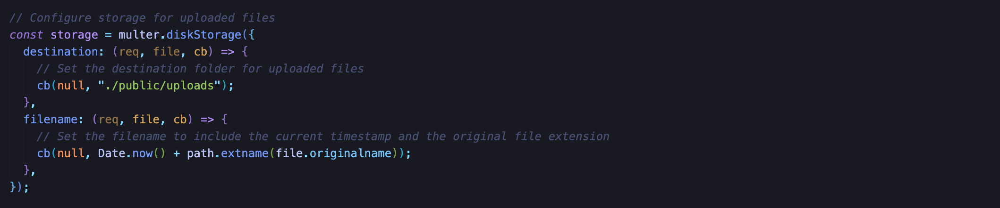
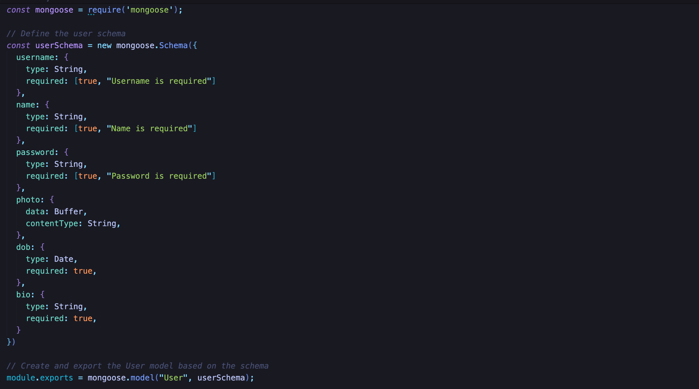

# manageSession

## 1. Project Structure

```
ManageSession/
├── controllers/
|   ├── index.js
├── middlewares/
|   ├── auth.js
|   ├── hash.js
|   ├── upload.js
├── models/
|   ├── user.js
├── public/
|   ├── images/
|   ├── css/
|   ├── javascripts/
|   ├── uploads/
├── routes/
|   ├── index.js
├── views/
|   ├── partials/
|   ├── homepage.js
|   ├── signup.js
|   ├── signin.js
├── .env
├── .gitignore
├── app.js
├── package-lock.json
├── package.json
├── README.md
```

1. `controllers/`
This directory contains files responsible for handling the logic and functionality of the application.

2. `middlewares/`
Middleware functions are stored here. These functions can be applied to routes to perform tasks like authentication (auth.js), hashing (hash.js), and handling file uploads (upload.js).

3. `models/`
This directory holds the data models for interacting with the database.

4. `public/`
This directory usually contains static assets that can be served directly to the client, such as images, CSS files, and JavaScript files.

5. `routes/`
This directory probably contains JavaScript files defining the routes and corresponding handlers for the application.

6. `views/`
This directory typically contains files responsible for rendering HTML templates and views.

7. `.env`
This file contains ENVIRONMENT VARIABLES such as SECRET KEY, which is meant to be hidden and ignored by `.gitignore`.

8. `.gitignore`
Specifies files and directories to be ignored by Git, preventing them from being tracked.

9. `app.js`
This file is commonly used to store environment variables for the application.

10. `package.json` & `package-lock.json`
Manage dependencies and package versions.

11. `README.md`
A text file containing useful reference information about this project.

## 2. Packages:

1. `bcryptjs`
A library for hashing passwords.

2. `date-fns`
A JavaScript date utility library. It provides functions for working with dates, including formatting and parsing.

2. `dotenv`
A zero-dependency module that loads environment variables from a .env file into process.env. This is useful for managing configuration in your Node.js applications.

3. `ejs`
Embedded JavaScript templating engine for rendering dynamic content on the server side.

4. `express`
A popular web framework for Node.js that simplifies the process of building web applications. 

5. `express-session`
Middleware for handling sessions in Express.js. It provides session management and can store session data, often backed by a database or memory store.

6. `mongodb`
The official MongoDB driver for Node.js. It allows your Node.js application to interact with a MongoDB database.

7. `mongoose`
A higher-level abstraction over the MongoDB driver, providing a more convenient and structured way to work with MongoDB databases in a Node.js environment.

8. `multer`
A middleware for handling file uploads in Express.js. It's often used with forms that include file input fields.

9. `nodemon`
A utility that monitors for changes in your Node.js application and automatically restarts the server when changes are detected. 

## 3. Build

To clone and run this project, you'll need [Git](https://git-scm.com) and [Node.js](https://nodejs.org/en/download/) (which comes with [npm](https://npmjs.com)) installed on your computer.

- Prequisite: VSCode or Other IDE / Editor

- From your CLI, Terminal or SHELL:

```bash
# Clone this repository
$ git clone https://github.com/HaAnh18/manageSession.git

# Install dependencies
$ npm install

# Start with npm
$ npm start

# OR Start with node
$ node app.js
```

## 4. Custom Database

To change the database location, you'll need to go to `.env` file and change the value of variable DATABASE to your own MongoDB link 


## 5. Description

### Set Up Session And Database

#### Session


- `secret` Property:

  - This property is required and is used to sign the session ID cookie. It should be a string or an array of strings.

  - In this case, the secret is retrieved from the environment variable `process.env.SECRET`, which should be set to a secure and unique value.

- `saveUninitialized` Property:

  - When set to `false`, this property ensures that sessions are not saved for requests that have not modified the session data.

  - Setting it to `false` can help reduce server storage usage and save resources by only creating a session when necessary.

- `cookie` Property:

  - This property is an object specifying various options for the session cookie.

  - `maxAge`: Specifies the maximum age (in milliseconds) of the session cookie. In this case, it's set to 60 minutes (60 * 60 * 1000 milliseconds).

#### Database


- This function connects the Node.js application to a MongoDB database using the Mongoose library. 

- The connection URI is obtained from the `process.env.DATABASE` environment variable. If the connection is successful, a message is logged; otherwise, any errors are logged to the console.

- This is a common pattern for setting up database connections in Node.js applications.

### Middleware Functions

#### Check Authentication


- Middleware `isAuthenticated` checks user authentication using `req.session.userId`.

- If no `userId` is found, it renders `signin` with a log-in message.

- If authenticated, fetches user data and assigns to `req.user`.

- Passes control to the next middleware or route handler using `next()`.

- Includes error handling for unexpected issues during data retrieval.

- Ensures protected routes are accessed only by authenticated users.

#### Hash Password


- Function hashing passwords using `bcryptjs`.

- Imports the `bcryptjs` library for password hashing and salting.

- Uses `bcrypt.genSalt()` to asynchronously generate a salt for password hashing.

- Calls` bcrypt.hash()` to hash the provided password using the generated salt.

- Returns the hashed password.

#### Handle Uploaded Photo



- Multer is configured with a disk storage engine `multer.diskStorage` to define the destination and filename for storing uploaded files

- The `destination` function will determine where file will be stored and in this function, all of the uploaded files will be saved in `/public/uploads`

- The `filename` function will generate a unique filename based in the current timestamp and the original file extension


- The `fileFilter` function will be used to validate the uploaded file is acceptable based on its mimetype and extension

- The variable `fileTypes` defines a regular expression that matches allowed file formats: JPEG, JPG, PNG, and PDF.

- If both the mimetype and extension are allowed, `cb(null, true)` is called to accept the file. Otherwise, an error message is rendered in the `signup` view.

### User Model



- The `userSchema` is created using `mongoose.Schema`. It defines the structure of the documents that will be stored in the MongoDB collection associated with the `User` model.

### Controller Functions

#### Get Sign Up


- Renders the `signup` view if the user is not already authenticated; otherwise, redirects to the homepage.

#### Get Sign In


- Renders the `signin` view if the user is not already authenticated; otherwise, redirects to the homepage.

#### Sign Up


- Hashes the provided password using the `hashPwd` middleware.

- Collects user data from the request body, including username, name, hashed password, photo, date of birth, and bio.

- Checks if the username already exists in the database; if so, renders the `signup` view with an error message.

- Creates a new user in the database with the provided data and redirects to the signin page.

#### Sign In


- Retrieves user credentials from the request body.

- Finds a user in the database based on the provided username.

- Compares the provided password with the hashed password stored in the database.

- If the credentials are valid, sets the user ID in the session and redirects to the homepage; otherwise, renders the `signin` view with an error message.

#### Sign Out


- Destroys the user session to log them out.

- Redirects to the signin page after successfully destroying the session.

#### Get Homepage


- Formats the user's date of birth to a readable format using `date-fns`.

- Renders the `homepage` view with the user data and formatted date of birth.

## 6. The Model-View-Controller (MVC) Architecture


### Model (M)

- The model interacts with the MongoDB database through Mongoose, providing an abstraction for CRUD (Create, Read, Update, Delete) operations on file-related data.

### View (V)

- The EJS templates serve as the views in the application.

- They contain HTML structures with embedded JavaScript code (using EJS syntax) to dynamically generate content based on the data provided by the controller.

### Controller (C)

- The controller in the application handles the logic and acts as an intermediary between the model (data) and the views (presentation). 

## 7. Screenshots

### Sign up page


### Sign in page


### Homepage


## 8. License

This software is licensed under the MIT License ©
